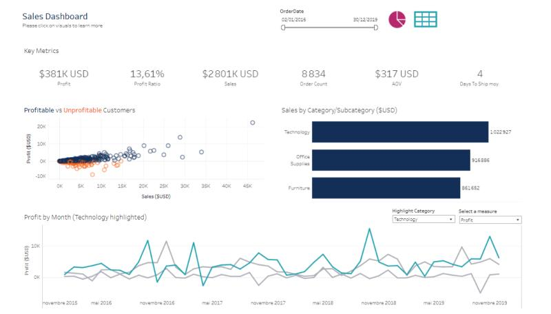
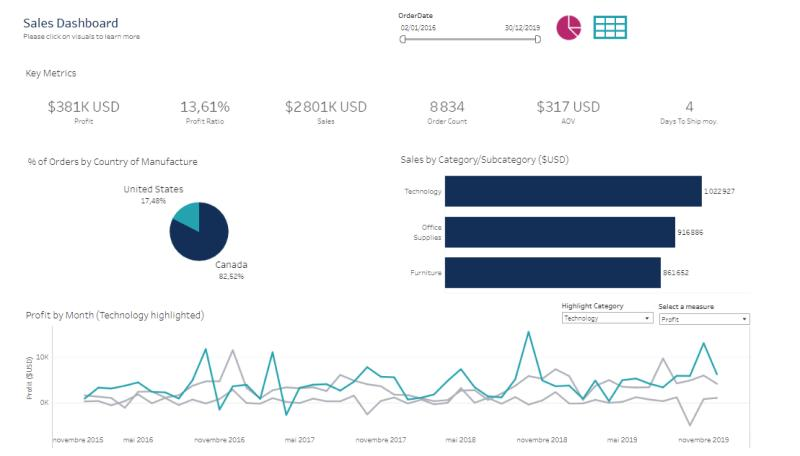
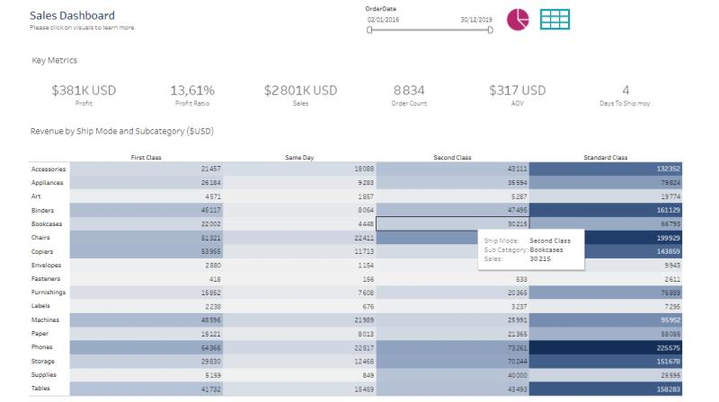
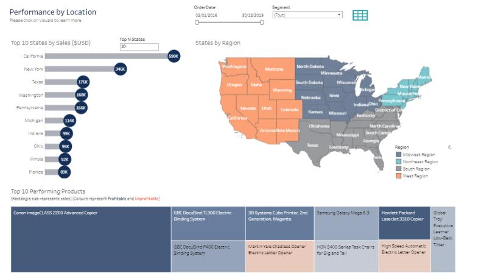
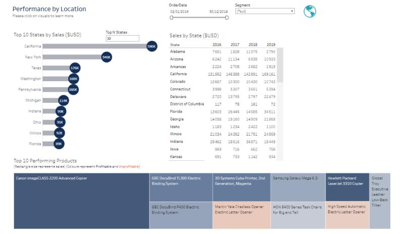

# 📊 Sales Performance Analysis with Tableau

## 📑 Table of Contents

1. [Project Overview](#project-overview)  
2. [Data Sources](#data-sources)  
3. [Data Preparation and Modeling](#data-preparation-and-modeling)  
4. [Dashboards](#dashboards)  
5. [Technical Architecture](#technical-architecture)  
6. [Results & Insights](#results--insights)  
7. [Limitations & Improvements](#limitations--improvements)  
8. [Author](#author)  

---

## 🚀 Project Overview

This project focuses on analyzing **Sales and Profitability** data using **Tableau**.  
The goal is to provide interactive dashboards that give insights into:

- Sales and profitability trends over time.  
- Performance by product category and subcategory.  
- Customer segmentation (profitable vs. unprofitable).  
- Sales distribution by shipping mode.  
- Regional and state-level performance across the US.  

Two main dashboards were developed:  

1. **Sales Dashboard** → Analysis by category, customer profitability, and ship mode.  
2. **Performance by Location** → Analysis by region, state, and top-performing products.  

---

## 📂 Data Sources

* **Sales Dataset**: Includes transactions with details such as order date, sales amount, profit, quantity, ship mode, customer, region, category, and subcategory.  
* **Calendar/Date Dimension**: Used for time-based analysis of sales and profit trends.  

---

## 🔄 Data Preparation and Modeling

The following steps were applied to prepare the dataset in Tableau:

* Cleaned and standardized data fields (renamed columns, adjusted data types).  
* Created calculated fields to define **KPIs** (Profit Ratio, AOV, Days to Ship).  
* Built hierarchies (Year → Month) to support drill-down analysis.  
* Modeled relationships between dimensions (Category, Subcategory, Region, Ship Mode) and fact data.  

---

## 📊 Dashboards

### 🔹 Sales Dashboard  

Includes:  
- Key KPIs (Profit, Profit Ratio, Sales, Orders, AOV, Days to Ship).  
- **Profitable vs. Unprofitable Customers** scatter plot.  
- Monthly profit trend by product category.  
- Sales by category and subcategory.  
- Revenue distribution by ship mode.  

📌 Screenshots:  
  

---
  

---
 

---

### 🔹 Performance by Location  

Includes:  
- Top 10 states by sales.  
- Sales and profit distribution by **region** (US map visualization).  
- Top-performing products (highlighting profitable vs. unprofitable).  

📌 Screenshot:  
  

---
 

---

## 🏗️ Technical Architecture

This project was built entirely in Tableau:  

1. **Data Import** → Load sales dataset into Tableau.  
2. **Data Preparation** → Apply cleaning, calculated fields, and hierarchies.  
3. **Visualization** → Build dashboards with interactive filters, collapsible containers, and floating layouts.  
4. **User Interaction** → Enable drill-down, hover tooltips, and category/region filtering.  

---

## 📈 Results & Insights

* **Technology** category drives the highest revenue (~$1M).  
* **Profitability ratio** is ~13.6%, showing room for optimization.  
* **Profitable vs. unprofitable customers** analysis identifies customers generating losses despite high sales.  
* Shipping mode analysis shows **Standard Class** dominates in revenue share.  
* Regional analysis highlights **California, New York, and Texas** as top contributors.  
* Some products are consistently unprofitable, indicating areas for cost review.  

---

## ⚠️ Limitations & Improvements

* The dataset is static; a **real-time data refresh** could be implemented via Tableau Server/Online.  
* **Predictive modeling** (e.g., sales forecasting) could be added.  
* Include **customer segmentation dashboards** for marketing insights.  
* Implement **row-level security** if published on Tableau Server.  

---

## 👩‍💻 Author

**Rania Alayachi**  
📧 alayachi.rania23@gmail.com
  
🔗 [[LinkedIn Profile]](https://www.linkedin.com/in/rania-al-ayachi/)  

---
